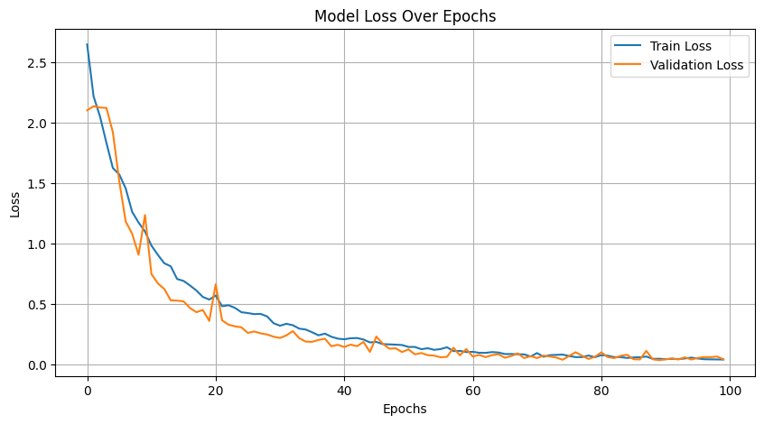
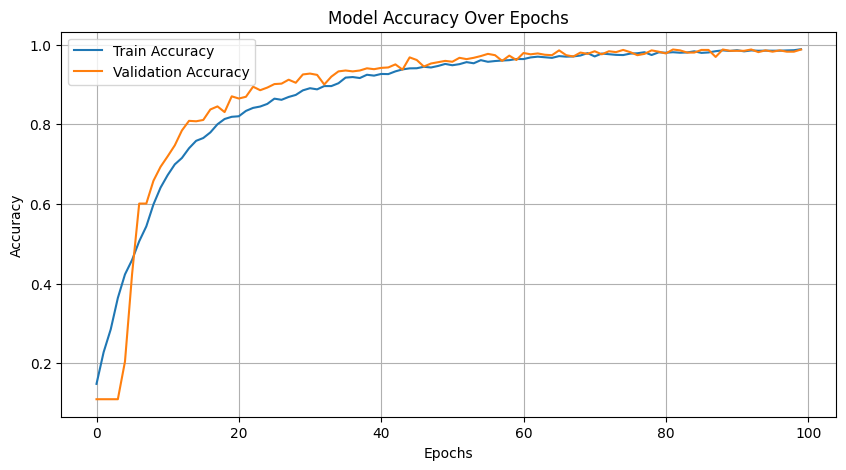
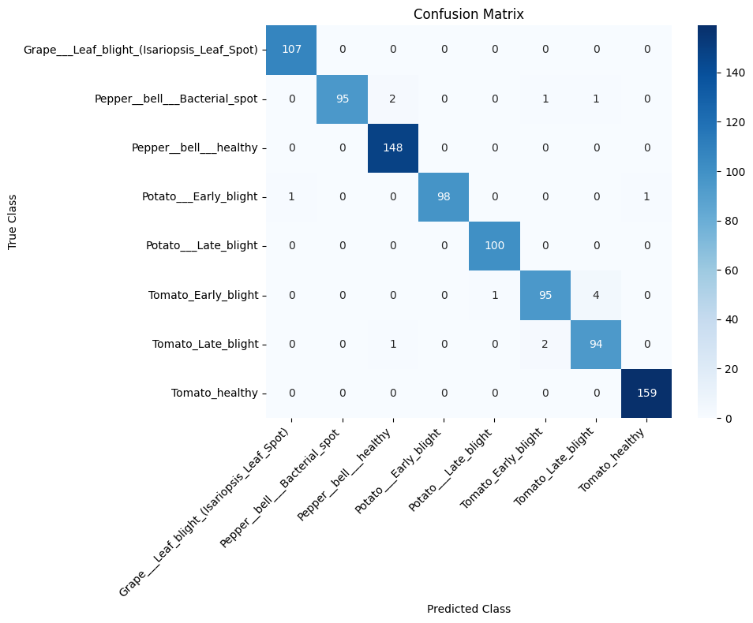
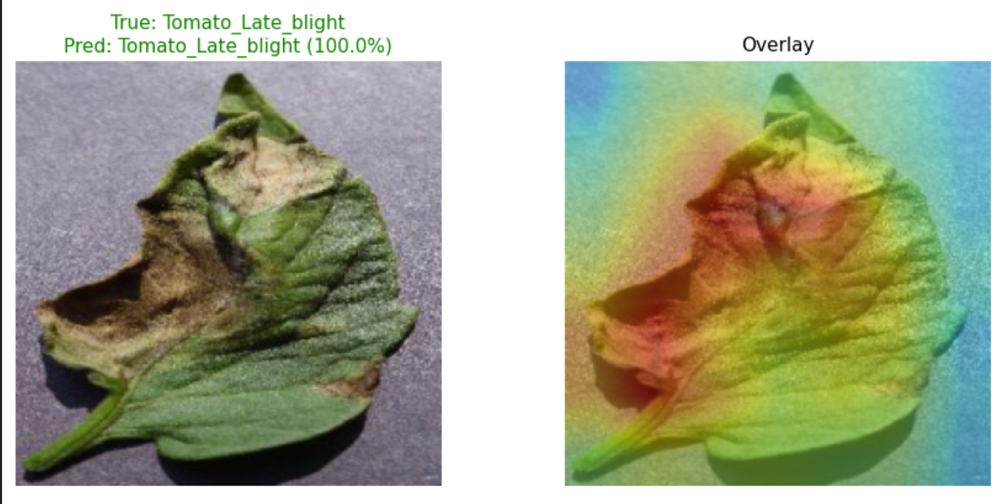
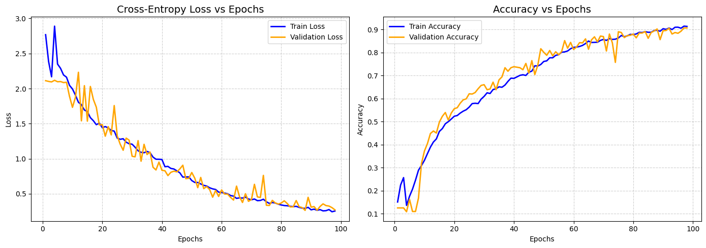
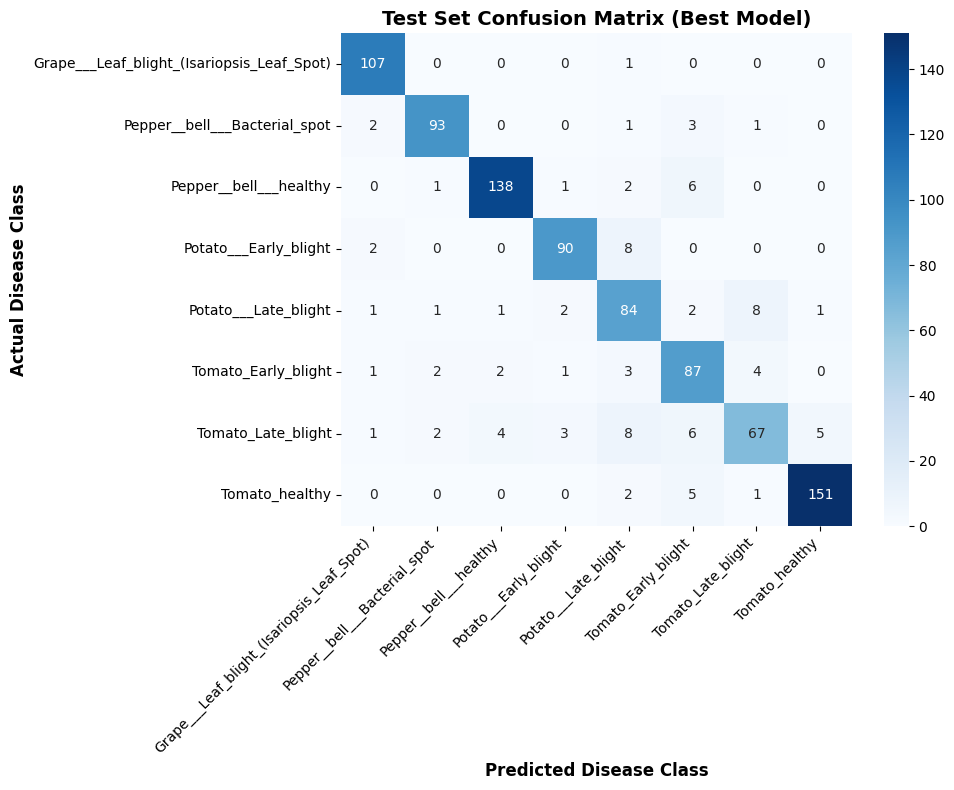
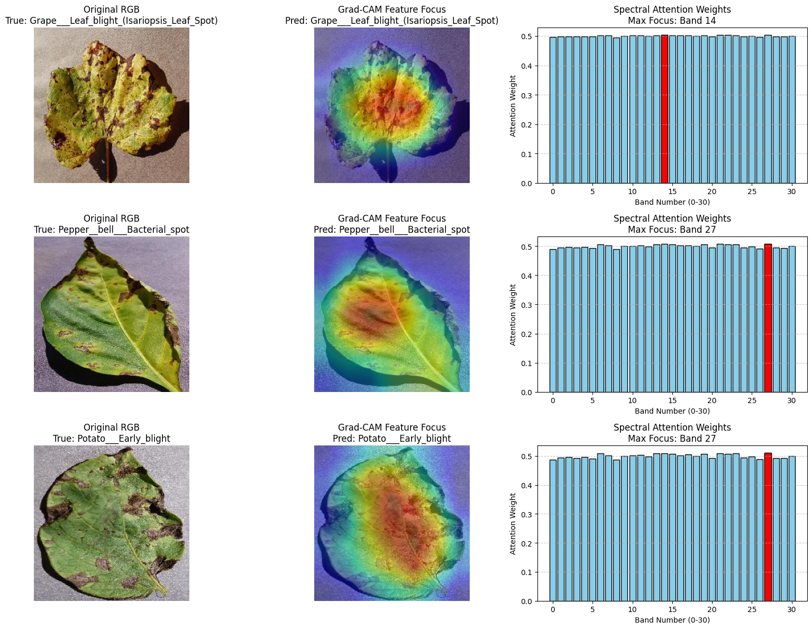
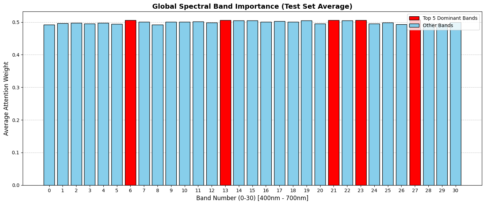

## Getting Started

### Prerequisites
- Python 3.8
- CUDA-capable GPU (10GB+ VRAM recommended)

### Installation

```bash
git clone https://github.com/shaShvat07/mtp.git
cd mtp
pip install -r requirements.txt
```

---


# MST++ Implementation and Annotation for Plant Disease Detection

This repository contains an implementation of the **MST++ (Multi-stage Spectral-wise Transformer)** for spectral reconstruction, applied to a potato leaf disease dataset. The project pipeline includes training the spectral reconstruction model and a comprehensive inference workflow that annotates RGB images, converts them to Hyperspectral Images (HSI), and visualizes bounding box annotations on both modalities.

## 📌 Project Overview

## Visuals 
* RGB TO HSI
  


* Training loss v/s iterations


## 🚀 Usage Guide

## Dataset

This project utilizes the [PlantVillage Dataset](https://www.kaggle.com/datasets/emmarex/plantdisease), a publicly available, open-access repository of images featuring healthy and diseased crop leaves. The original dataset serves as the foundational RGB baseline for our comparative training and synthetic Hyperspectral Imaging (HSI) dataset generation. 

### Classes Used

For this specific implementation and model training, a subset of 8 classes was selected from the broader dataset, focusing on grape, pepper bell, potato, and tomato leaves:

*   Grape: Leaf Blight (Isariopsis Leaf Spot)
*   Pepper Bell: Bacterial Spot
*   Pepper Bell: Healthy
*   Potato: Early Blight
*   Potato: Late Blight
*   Tomato: Early Blight
*   Tomato: Late Blight
*   Tomato: Healthy

The dataset is taken from Plant village dataset 

### Training the MST++ Model

To train the MST++ spectral reconstruction model:

1. Navigate to the training directory:
   ```
   cd mst_plus_plus_training
   ```
2. Open the Jupyter Notebook located in this folder.
3. Run **all cells** sequentially to start the training process.
4. Once training is complete, the best model checkpoint (`.pth` file) will be tell by the code, you need to copy it from the checkpoints.


## Running the Pipeline

### Step 1 — Train MST++ for Spectral Reconstruction
```bash
cd "mst_plus_plus_training"
jupyter notebook
```
Run all cells sequentially. Copy the best `.pth` checkpoint into `best_model/` when training completes.

### Step 2 — Convert RGB Dataset to HSI
```bash
jupyter notebook rgb_to_hsi_pipeline.ipynb
```
You will be prompted to enter the input dataset path and the output directory path. The notebook will convert all RGB images to 31-channel `.mat` hyperspectral datacubes.

> Note: Peak GPU memory during conversion can reach up to 33GB. Patch-based sliding window inference and mixed precision (FP16) are used automatically to manage memory.

### Step 3 — Train RGB Classifier
Open and run `index.ipynb` with the RGB dataset path configured. Best weights are saved automatically as `best_efficientnet_plant_disease.pth`.

### Step 4 — Train HSI Classifier
```bash
jupyter notebook index_hsi.ipynb
```
Point the dataset path to your converted HSI `.mat` directory. Best weights are saved as `best_plant_hsi_disease.pth`. Training supports seamless resumption from interruptions via epoch-level checkpointing.

---

## Results

### RGB Classification — EfficientNet-B0
> Test Accuracy: **98.46%** | Macro F1: **0.98**

#### Training Loss vs Epochs


#### Training Accuracy vs Epochs


#### Confusion Matrix


#### Grad-CAM


---

### HSI Classification — HSI-EfficientNet
> Test Accuracy: **90.22%** | Macro F1: **0.89** | Best Epoch: **88** | Early Stopping: **Epoch 95**

#### Training Loss and Accuracy vs Epochs


#### Confusion Matrix


#### Grad-CAM + Spectral Band Importance


#### Global Spectral Band Importance


## References

**MST++: Multi-stage Spectral-wise Transformer for Efficient Spectral Reconstruction**
Cai et al., CVPR Workshops 2022.
[Paper](https://openaccess.thecvf.com/content/CVPR2022W/NTIRE/papers/Cai_MST_Multi-Stage_Spectral-Wise_Transformer_for_Efficient_Spectral_Reconstruction_CVPRW_2022_paper.pdf)

**PlantVillage Dataset** — Hughes & Salathé, arXiv 2015.

**EfficientNet** — Tan & Le, ICML 2019.

